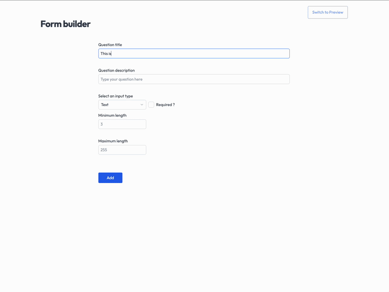

# React Form Builder

[](https://opensource.org/licenses/MIT)
[](https://reactjs.org/)
[](https://www.typescriptlang.org/)
[](https://tailwindcss.com/)
[](https://vitejs.dev/)

A dynamic form builder application built with React that allows you to create custom forms similar to Google Forms. Users can design forms with various input types and view the form in preview mode before publishing.



## Features

- Create custom forms with different input types:
  - Text inputs
  - Number inputs
  - Select/Options inputs
- Configure validation rules for each input:
  - Required fields
  - Min/max text length
  - Min/max number values
- Live preview of your form
- Auto-save draft entries while editing
- Form validation on submission
- Responsive UI with Tailwind CSS

## Demo

Check out the live demo: [React Form Builder Demo](https://dreamy-squirrel-4cd603.netlify.app/)

## Getting Started

### Prerequisites

- Node.js (version 14.x or higher recommended)
- npm or yarn

### Installation

1. Clone the repository

```bash
git clone https://github.com/shirshendubhowmick/form-builder.git
```

2. Navigate to the project directory

```bash
cd form-builder
```

3. Install dependencies

```bash
npm install
```

4. Start the development server

```bash
npm run dev
```

5. Open your browser and visit: `http://localhost:3000`

## Usage

1. **Form Builder Mode**:

   - Add questions by filling in the form and clicking "Add"
   - Configure question properties (required, min/max values, etc.)
   - Edit existing questions by expanding them in the accordion
   - Remove questions with the trash icon

2. **Preview Mode**:
   - Click "Switch to Preview" to see how your form will look to users
   - Test form validation by submitting the form
   - Return to builder mode by clicking "Switch to Builder"

## Technologies Used

- [React](https://react.dev/)
- [TypeScript](https://www.typescriptlang.org/)
- [Tailwind CSS](https://tailwindcss.com/) for styling
- [Zod](https://zod.dev/) for schema validation
- [Radix UI](https://www.radix-ui.com/) for accessible UI components
- [React Toastify](https://fkhadra.github.io/react-toastify/) for notifications
- [Vite](https://vitejs.dev/) for fast development and building

## Error Simulation

While interacting with the app, you may face API errors. These are simulated errors to test the error handling of the app. The errors occur randomly based on a set probability. You can change the probability of errors in the api.ts file by adjusting the value of `ERROR_PROBABILITY`.

## Development

### Project Structure

```
src/
  ├── components/      # Reusable UI components
  ├── schemas/         # Zod validation schemas
  ├── services/        # API and storage services
  ├── types/           # TypeScript type definitions
  ├── utils/           # Utility functions
  ├── views/           # Main view components
  │   ├── Builder/     # Form builder interface
  │   └── Renderer/    # Form preview interface
  ├── App.tsx          # Main application component
  └── index.tsx        # Entry point
```

### Available Scripts

- `npm run dev` - Start the development server
- `npm run build` - Build the application for production
- `npm run lint-staged` - Run linters on staged files (pre-commit)

## License

This project is licensed under the MIT License.

## Author

Shirshendu Bhowmick
